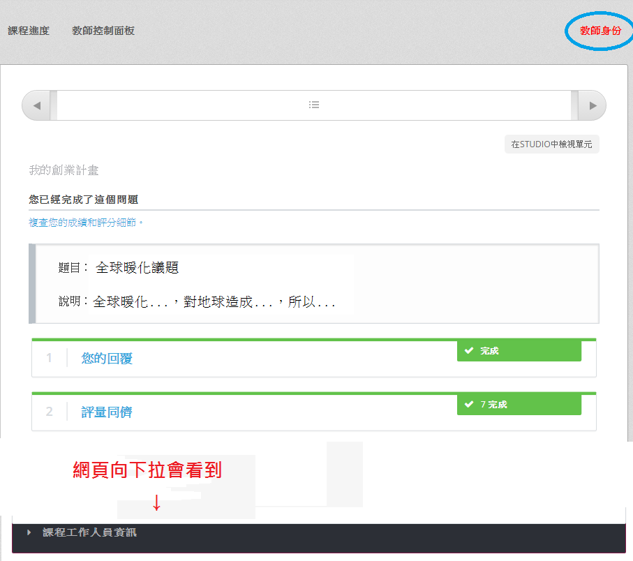
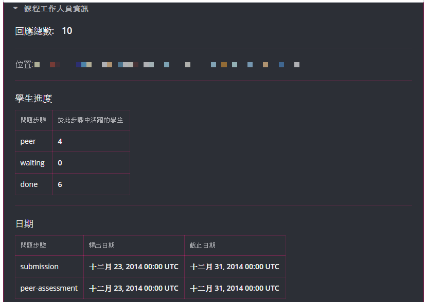
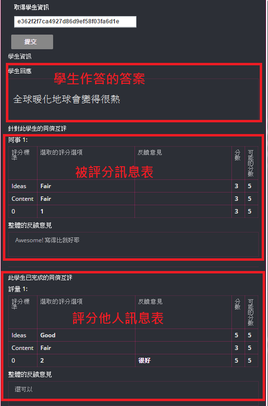

.. _PA Accessing Assignment Information:

##########################################
取得開放式問題相關資訊與學生進度
##########################################

在開放式問題發佈之後，你可以查看整體或是個別學生在開放式問題中的狀態。這些訊息只有 **課程工作人員** 可以在開放式問題下方可以觀看，如果想要查看這些資訊，請把開放式問題的網頁拉至最底下，然後點選 **課程工作人員資訊** 就會看到目前的學生進度與日期資訊。

.. _PA View Metrics for Individual Steps:

************************************************
觀看學生在每個階段的進度
************************************************

你可以根據以下步驟查看已完成、正在作答或評分階段學生的數量

* 把開放式問題的網頁拉至最底下
* 點選 **課程工作人員資訊**

裡面包含各個階段學生的數量和各個階段的日期資訊。

.. _Access Information for a Specific Student:

***********************************************
取得特定學生的資訊
***********************************************

你可以取得特定學生的相關資訊，可以取得的資訊包含：

* 學生的回應
* 該學生回應的被評分數與評分回饋
* 該學生評分其他同學的分數與評分回饋
* 該學生的自我評分

下圖為存取某位學生的相關資訊示意圖：

取得特定學生資訊更完整的範例請參考 :ref:`Access Student Information`.

要取得特定學生的資訊要經由下面幾個步驟：

#. 取得學生課程的匿名ID
#. 在 **課程工作人員資訊** 裡面找到 **取得學生資訊**
#. 在取得學生資訊下方的欄位輸入 **學生匿名ID**
#. 點選 **提交** 按鈕

=====================================================
取得學生課程的匿名ID
=====================================================

要找出學生匿名ID，將會需要2個 .csv 檔，一個是在教師控制面板中的 **成績報告** (**<課程名稱>_grade_report_<日期>.csv**) 另一個是 **取得學生的匿名 IDs CSV**  (**<課程名稱>-anon-ids.csv**).

#. 在課程中，點選 **教師控制面板**
#. 在教師控制面板中，點選 **資料下載**
#. 在 **資料下載** 頁面中，點選 **取得學生的匿名 IDs CSV**。接著會以檔名  **<課程名稱>-anon-ids.csv** 自動下載。
#. 網頁往下拉找到 **報告** 段落，點選 **產生成績報告**. 

   系統將會自動開始產生成績報告，當他完成時，一個下載的連結將會出現在下方 **報告已可供下載**

   .. note:: 如果成績報告檔案較大，可能會花費較多時間

#. 當成績報告的連結出現 **報告已可供下載** ，下載並且開啟他
#. 當你有了這兩份文件，請開啟 **<課程名稱>_grade_report_<日期>.csv**。根據使用者名稱或是墊子郵件地址找到你想要的學生， 記錄他ID欄位中的資訊。 在下面的例子中，學生的墊子郵件地址為 ``amydorrit@example.com`` (使用者名稱 ``lildorrit``) ID是 ``18557``.

   .. image:: Images/PA_grade_report.png
      :width: 500
      :alt: Spreadsheet listing enrolled students and grades

#. 接著開啟 **<課程名稱>-anon-ids.csv** ，找到你在步驟6中紀錄的ID，複製在 **"Course Specific Anonymized user ID"** 欄位中 (**column C**) 的值。該值就是我們所要找的學生的匿名ID。 在下面的例子中，我們要找的學生ID為 ``18557`` 匿名ID為 ``ofouw6265242gedud8w82g16qshsid87``.

   .. image:: Images/PA_anon_ids.png
      :width: 500
      :alt: Spreadsheet listing students' anonymous user IDs

   .. note:: 請注意不要複製到 Anonymized User ID 欄位，我們需要的是 **Course Specific Anonymized User ID** 欄位的資料。

.. _Access Student Information:

=======================================
取得學生資訊
=======================================

#. 在課程中，請到你想要取得資訊的開放式問題
#. 將網頁拉至最底下，點擊 **課程工作人員資訊**
#. 找到並點擊 **取得學生資訊** ，輸入學生的匿名ID，點選 **提交**.
