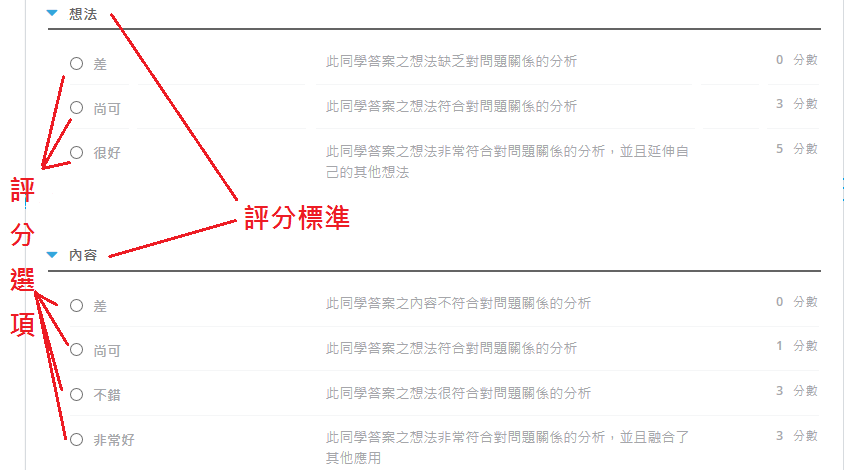
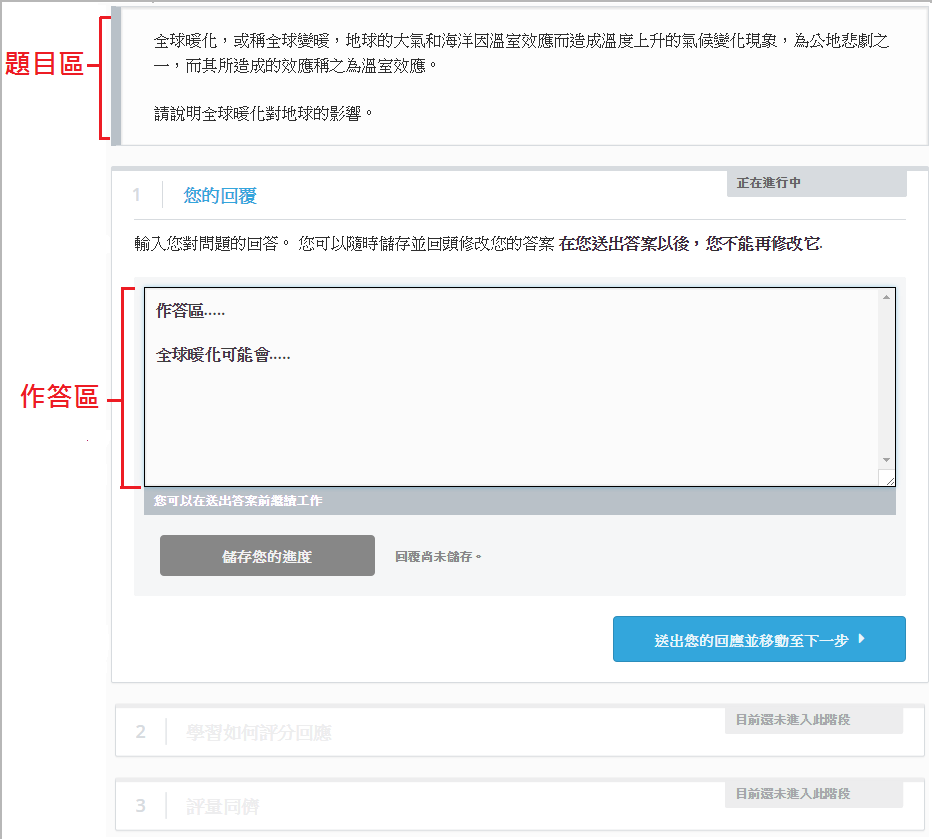
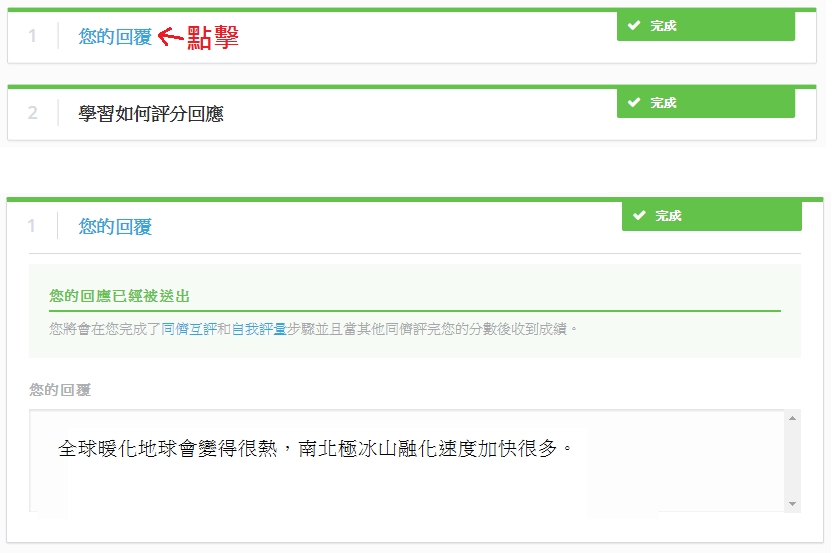
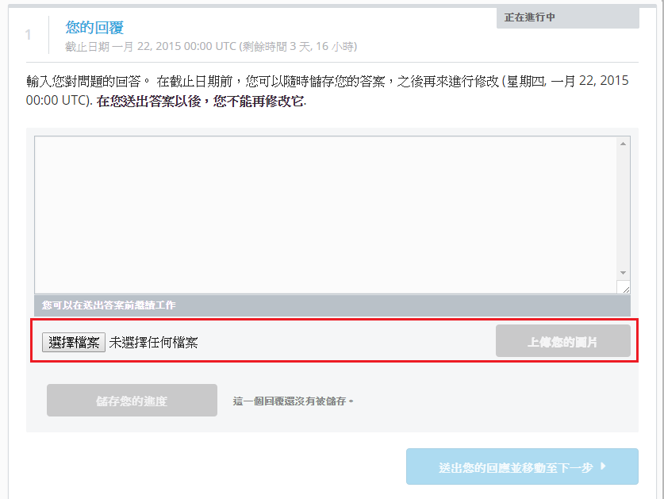
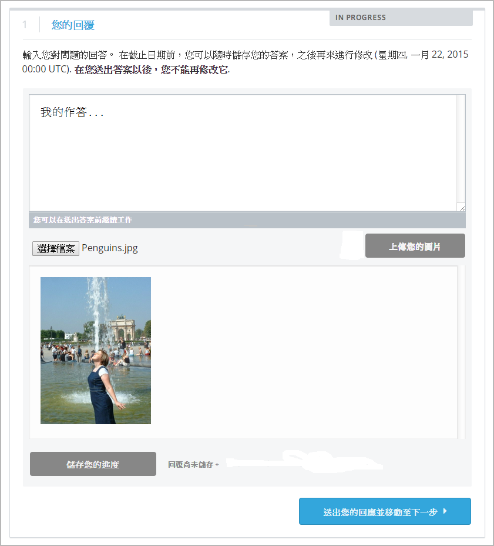
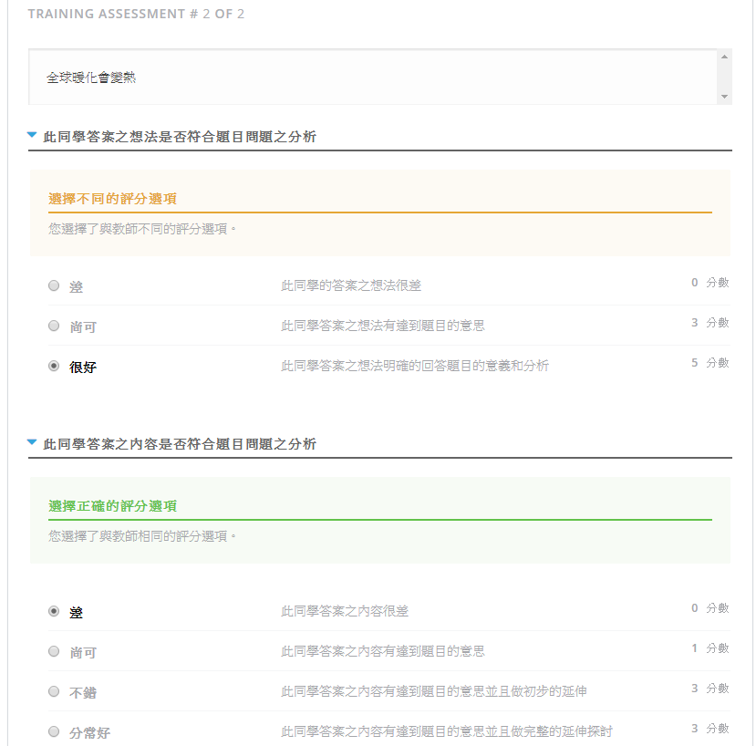
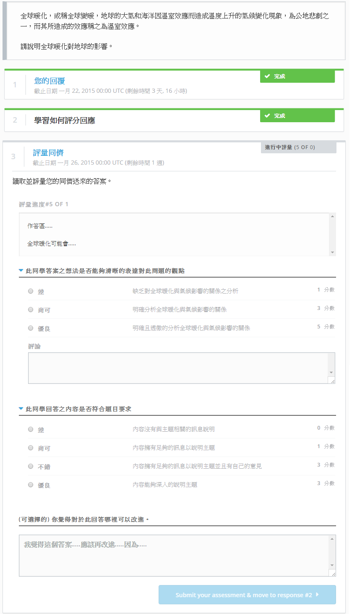
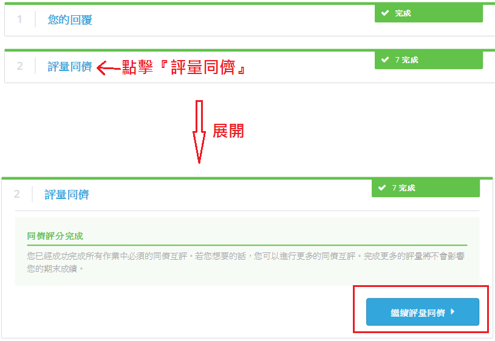
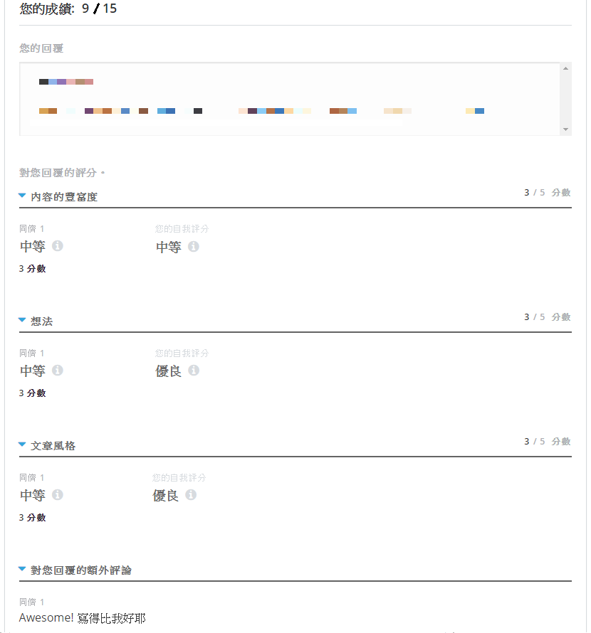
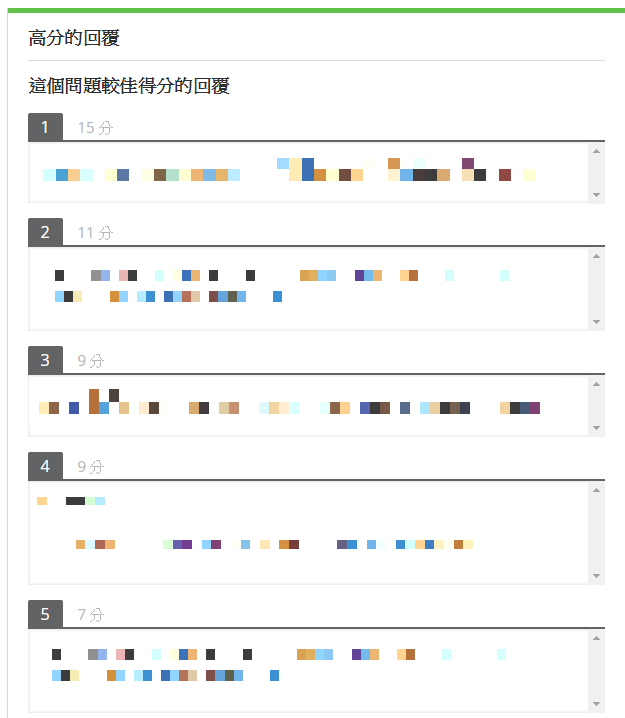

.. _PA for Students:

###########################################
學生的同儕互評
###########################################

你可能會想讓學生知道如何完成一份同儕互評，這份文件將透過每一個步驟的講解引導學生完成。

**************************************************
對學生的同儕互評介紹
**************************************************

在同儕互評中，你將會針對題目來作答，而作答時不僅僅是簡單的回覆，甚至有些同儕互評會要求學生繳交書面報告、演講影片或者程式碼等等。

同儕互評中，評分的部分包含了評分同儕、自我評分或者兩者都有。在評分同儕階段，你將會看到其他同學的作答並給予評分和一些回饋，同理，你的作答也會被其他同學評分。而自我評分階段，你將評分自己的作答，目的是在看成績時來與同儕互評階段的分數做比較，進而去思考或了解自己的評分想法和其他同學的評分想法有何不同。

一份 **評分量表** 是對於評分作答的一個預期分數表，他由 **評分標準** 與 **評分選項** 所構成。 **評分標準** 是一個評分主題的簡短概要，例如『想法』或『內容』； **評分選項** 是在一個評分標準底下，評斷作答的好壞，例如『很好』或『尚可』。

當你在評分時，你將針對答案選出一個最符合評分標準的評分選項。

************************
學生說明 Student Instructions
************************

當你進到同儕互評題型中，你將會看到問題區與作答區，當你送出作答之後，你將會看到其他同學或是自己的作答，並要給予評分，順序是根據出題者設定的，下圖為一個同儕互評題型的畫面：

你將會透過以下幾個步驟來完成一個同儕互評題型：

#. 針對題目的要求送出一個作答
#. 學習如何評分作答
#. 評分同儕的作答
#. 評分自己的作答(如果有)
#. 觀看成績與同儕的回饋

在作答時的任何時間點，你都可以在網頁的底下看到 **您的成績** ，他會告訴你還有哪些步驟還沒完成，只有在所以步驟都完成後才可以觀看成績。 若你只送出一個回應，往下拉可能會看到下列訊息：

.. code-block:: xml

  您的成績：未完成
  您還沒有完成這個問題的所有步驟。

=====================
送出作答
=====================

仔細閱讀題目。題目中可能包含一些重要的訊息，像是回答字數至少要多少或是針對哪些主題作答等等。

.. note:: 作答字數必須少於 10000 個字元。

當你要作答時，請在 **您的回覆** 區塊內填寫答案，完成後請點擊 **送出您的回應並移動至下一步** 。 如果你無法一次完成所有作答，可以點擊 **儲存您的進度** ，如此一來可以將目前所撰寫的答案保留，待下次再繼續作答。

再送出回應之後，如果同儕互評階段已經開始並且已經有其他同學送出答案，你就可以開始觀看並且評分其他同學的作答，但是你不一定要立即評分，系統會自動儲存你目前的階段，如果你想要下次再來評分，只要重新整理網頁即可繼續。

如果同儕互評階段已經開始，但是還沒有其他同學送出答案，你會看到下列訊息：

.. code-block:: xml

  等待同儕提交回應
  所有提交答案已全部評分。之後再確認是否有更多的學生遞交答案。您將會在完成所有針對此問題的評分，以及您的同儕完成對您的評分後收到成績。

提交答案後可以在任何時間點觀看你的作答，只要點選 **您的回覆** ，該區塊就會展開，即可看到你的作答。

伴隨圖片送出作答
***********************************

在某些題目中允許你上傳圖片作答，如果你可以上傳圖片，你在作答區塊下會看到選擇檔案的按鈕
Some assignments allow you to submit an image with your text response. If you can submit an image, you'll see buttons that you'll use to upload your image.

藉由以下步驟上傳圖片

#. 點擊 **選擇檔案**.
#. 找到你要上傳的圖片，點擊 **開啟**.
#. 當選取檔案的視窗關閉時，點擊 **上傳您的圖片**.

.. note:: 注意，圖片的檔案格式必須為 .jpg 或 .png ，並且檔案大小要 **小於5 MB**。

你的圖片會顯示在回覆區塊底下，檔案名稱會顯示在 **選擇檔案** 的右邊，如果你想要更換圖片，請重複上述步驟1~3即可

.. note:: 注意，在送出回應時，必須包含文字，不可以只上傳一張圖片作答。

============================
學習如何評分
============================

在此階段，你將藉由一些作答範例來學習如何評分，你將持續評分到與出題者相同的評分，才可進入下一個階段。

.. note:: 並不是所有的題目都有學習評分，當出題者有開啟學習評分才會有此階段。

在你送出作答後，會出現作答的範例和評分量表，仔細閱讀作答範例並且給予評分，選擇你認為適當的評分選項，選擇好後點擊 **比較您與教師之間的選項** ，如果都選擇正確的話會進入到下一個範例或是下一個階段，如果選擇與教師不同，你會看到下列訊息：

.. code-block:: xml

  學習如何對答案評分
  您的答案與教師不同。請重新檢視答案並思考為何教師與您有不同的意見，之後再重新評分一次。

對於不同的評分標準，你會看到下面訊息，分別是選擇與教師不同與相同的情況：

.. code-block:: xml

  選擇不同的評分選項
  您選擇了與教師不同的評分選項。

.. code-block:: xml

  選擇正確的評分選項
  您選擇了與教師相同的評分選項。

在下圖中，此學生選擇了一個正確選項與一個不正確選項

你將要持續評分到與教師設定的評分相同才算完成，完成此階段後就會進到下一個階段。

=====================
同儕互評
=====================

當你開始同儕互評階段，你會看到題目、其他同學的作答與評分量表。同時，你也會看到評量進度，他會告訴你已經完成了多少個同儕互評。

評分的方式如同"學習如何評分"階段，你將針對每一評分選項選擇適當的評分標準，此外，你可以針對每一個評分標準給予回饋(如果有)，也可以針對該同學的作答給予整體性的回饋。

.. note:: 
預設情況下，學生可以在整個評分準則下方看到一個備註欄。您也可以為一至多個評分標準設定個別的備註欄。此備註欄最多包含300個字元。

備註欄將會出現於評分標準的下方。如下圖所示，第一個評分標準下有一個備註欄，而最下方也有對於整體答案的備註欄。

    .. image:: Images/PA_CriterionAndOverallComments.png
       :alt: Rubric with comment fields under each criterion and under overall response
       :width: 600

當你分數選項選擇完成與回饋輸入完成後，點擊 **Submit your assessment and move to response #<number>**。

當你送出一位同學的評分，會接著看到另外一位同學的作答，評分方式與上一位同學的評分一樣，你將重複這些步驟直到你的評分數量到達教師指定數量。

評分額外的同儕
********************************

當同儕評分階段完成後，如果你想要評分更多同儕的作答，只要點擊 **評量同儕** 區塊，他會延展出較完整的區塊，點擊 **繼續評量同儕** ，就可以繼續觀看並且評分更多同儕的作答。

=====================
評分自己的作答
=====================

當你完成了同儕互評階段，就會進到自我評分階段。 你將會看到你的作答與和先前一樣的評分量表，評分自己的作答，完成後點擊 **送出您的評量** 以完成此階段。

==========================================
查看分數與意見回饋
==========================================

當你完成自我評分後，如果你的答案還處於被同儕評分的階段，你會在 **您的成績** 區塊看到下列訊息：

.. code-block:: xml

  您的成績:正在等待評量

  您的回答仍在被同儕評分。在同儕評分後，您可以查看他們的評論內容並且獲得最後成績。

當你的答案已經被評分完成，你可以看到其他同學評的分數和你自己評的分數，你也可以看到同學評分的意見回饋。

=================================================
評分額外的同儕 (可選擇的)
=================================================

當同儕評分階段完成後，如果你想要評分更多同儕的作答，只要點擊 **評量同儕** 區塊，他會延展出較完整的區塊，點擊 **繼續評量同儕** ，就可以繼續觀看並且評分更多同儕的作答。

***********************
同儕互評分數
***********************

評分標準的分數是根據評分標準的 **中位數** 來表示，並不是平均分數。 舉例來說：在 *內容* 這個評分標準下，第一位同學給我10分，第二位同學給我7分，第三位同學給我8分，我的 *內容* 的分數就是8。

你的最終成績是由每一項評分標準的中位數計算出來的。
舉例來說，你在一項作答當中得到下列分數：

.. list-table::
   :widths: 25 10 10 10 10
   :stub-columns: 1
   :header-rows: 1

   * - 評分標準
     - 同儕 1
     - 同儕 2
     - 同儕 3
     - 中位數
   * - 想法 (最多10分)
     - 10
     - 7
     - 8
     - **8**
   * - 內容 (最多10分)
     - 7
     - 9
     - 8
     - **8**
   * - 語意 (最多5分)
     - 4
     - 4
     - 5
     - **4**

系統在計算最終分數時是這樣算的：

  **想法的中位數 (8/10) + 內容的中位數 (8/10) + 文法的中位數 (4/5) = 最終分數 (20/25)**

這邊在強調一次，分數的計算是根據評分標準的 **中位數**，並不是所得分數的平均值。

==================================
觀看高分的回覆 (可選擇的)
==================================

如果此題目有包含 **高分的回覆** ，你在完成所有步驟後可以在最底下觀看較高分的回覆。

